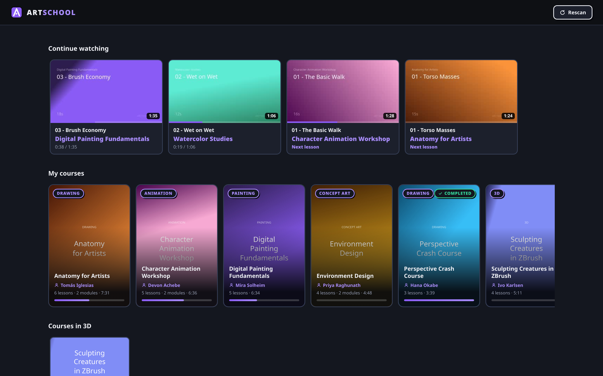
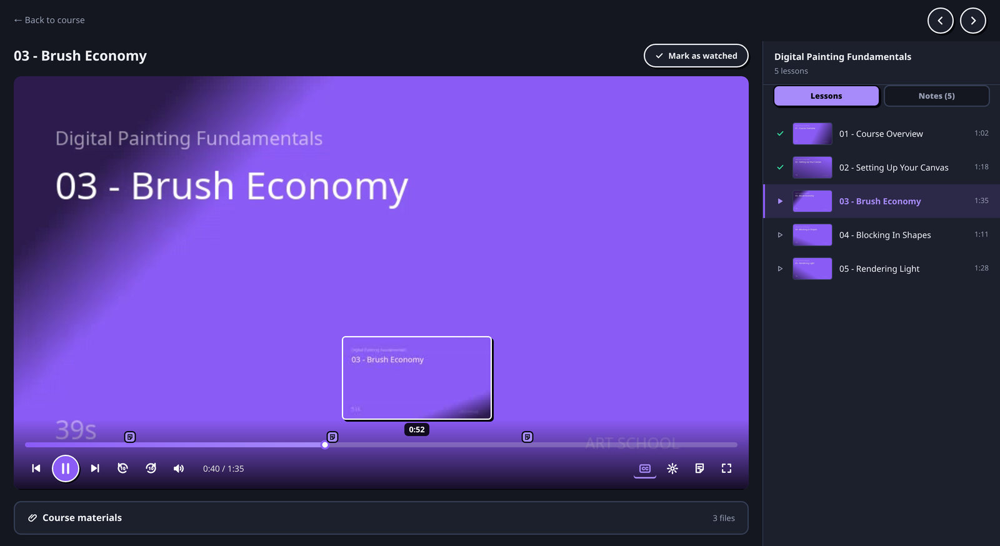

# 🎨 Art School

**A self-hosted platform for the video courses you already own.**

Point it at a folder full of course videos and it turns them into a proper learning
platform: a browsable catalog, per-lesson progress, resume where you left off,
timeline previews, subtitles, course materials and handwritten notes.

Think Jellyfin, but built around *courses* instead of movies — sections, lessons,
progress bars and "continue watching" instead of seasons and episodes.

No accounts, no cloud, no telemetry. Your files stay on your disk.

---

## Features

- **Zero-config catalog** — drop your course folders into one directory and Art School
  figures out courses, sections, lessons, materials and subtitles on its own.
- **Progress that survives everything** — lesson IDs are hashes of the relative path,
  so moving your library from a laptop to a NAS keeps every watched checkmark.
  Progress and notes are never wiped by a rescan.
- **Plays almost anything** — mp4/webm stream directly with seeking; mkv, mov and avi
  are remuxed on the fly by ffmpeg, and anything exotic falls back to live transcoding.
- **Timeline previews (trickplay)** — hover the seek bar to scrub through sprite-sheet
  thumbnails, generated in the background and cached in the database.
- **Notes with drawings** — take a note pinned to a timestamp, sketch over it with a pen
  or eraser, and jump back to that exact moment from a marker on the timeline.
- **Subtitles, your way** — `.srt`/`.vtt` sidecar files and `Subtitles/<Language>/` folders
  are picked up automatically, converted to WebVTT, and rendered with a custom overlay
  (size, color, background opacity, outline).
- **Player built for studying** — playback speed, autoplay next lesson, volume boost up
  to 200%, keyboard shortcuts, and a lesson list that always shows where you are.
- **Editable metadata** — rename a course, set its category and instructor, upload a
  cover image or pick any frame from any lesson as the banner.

## Screenshots

<!-- Add your own screenshots here, e.g.:


-->

---

## Quick start (Docker Compose)

Create a `docker-compose.yml`:

```yaml
services:
  artschool:
    image: brittinho/artschool:latest
    container_name: artschool
    restart: unless-stopped
    ports:
      - "3000:3000"
    volumes:
      # your course library (read-only is enough)
      - /path/to/your/courses:/courses:ro
      # database, thumbnails and timeline previews (must be writable)
      - ./artschool-data:/app/data
    environment:
      - COURSES_PATH=/courses
      - DATA_PATH=/app/data
      - PORT=3000
```

Then:

```bash
docker compose up -d
```

Open <http://localhost:3000>. On the first boot Art School scans your library, and then
computes durations and timeline previews in the background — the catalog is usable
immediately, while thumbnails keep filling in over the next few minutes.

> **Note:** ffmpeg is already bundled in the image. Nothing else to install.

### Docker CLI (without Compose)

```bash
docker run -d --name artschool \
  -p 3000:3000 \
  -v /path/to/your/courses:/courses:ro \
  -v /path/to/artschool-data:/app/data \
  brittinho/artschool:latest
```

### Updating

```bash
docker compose pull && docker compose up -d
```

Your progress, notes and custom covers live in the data volume, so they survive updates.

---

## Organizing your course folder

Art School reads the structure of your library — it never moves or renames your files.
A course is simply **a folder inside `COURSES_PATH`**.

```
courses/
├── painting_Digital Painting Fundamentals/   ← "painting" becomes the category
│   ├── cover.jpg                             ← optional custom cover
│   ├── 01 - Introduction.mp4
│   ├── 02 - Brushes.mp4
│   └── 02 - Brushes.srt                      ← sidecar subtitle for that lesson
│
└── animation_Character Animation/
    ├── Section 01 - Basics/                  ← subfolders with videos become sections
    │   ├── 01 - Timing.mp4
    │   └── 02 - Spacing.mkv
    ├── Section 02 - Advanced/
    │   └── 01 - Overlapping Action.mp4
    ├── Materials/                            ← downloadable course materials
    │   ├── brushes.abr
    │   └── reference.pdf
    └── Subtitles/
        ├── English/
        │   └── 01 - Timing.srt               ← matched by file name
        └── Spanish/
            └── 01 - Timing.srt
```

**The rules, in short:**

| Convention | What happens |
| --- | --- |
| `category_Course Title` | The part before the first `_` becomes the category; the rest is the title. A folder without `_` is a course with no category. |
| Subfolder containing videos | Becomes a **section** (module) of the course. |
| Videos loose in the course root | A flat course, with no sections. |
| Folders named `Materials`, `Resources`, `Assets`, `Files`… | Treated as **course materials**, even if they contain videos. |
| Any other folder without videos | Also treated as materials. |
| `Subtitles/<Language>/name.srt` | Subtitle track named after the language folder, matched to the lesson with the same file name. |
| `name.srt` next to `name.mp4` | Subtitle track labeled "Default". |
| `cover.jpg` / `banner.png` / `poster.jpg` / `folder.jpg` | Used as the course cover. Otherwise a frame is grabbed from the first lesson. |
| A course with only `.rar` / `.zip` files | Listed as **Not ready** — extract the archives and rescan. |
| Single-child folder chains (`Section 02/Section 02/*.mp4`) | Flattened automatically. |

Ordering is natural/numeric, so `2 - Intro` sorts before `10 - Outro`.

Added new courses? Hit **Rescan** in the top bar (or `POST /api/scan`). Rescanning
rebuilds the catalog but **never** touches your progress, notes or edited metadata.

---

## Configuration

| Variable | Default | Description |
| --- | --- | --- |
| `COURSES_PATH` | `./courses` | Folder holding your courses. In the Docker image: `/courses`. |
| `DATA_PATH` | `./data` | Where the SQLite database and thumbnail cache live. In the image: `/app/data`. |
| `PORT` | `3000` | HTTP port of the server. |

Everything else — subtitle style, playback speed, volume, autoplay — is a per-browser
preference stored in `localStorage`.

---

## Running from source

Requirements: **Node.js 22.13+** (uses the built-in `node:sqlite`, so there is no native
module to compile) and **ffmpeg/ffprobe available on your `PATH`**.

```bash
git clone https://github.com/britto64/art-school.git
cd art-school

npm install
npm install --prefix web

# development: API on :3000, UI on :5173 with hot reload
COURSES_PATH="/path/to/your/courses" npm run dev

# production build
npm run build
COURSES_PATH="/path/to/your/courses" npm start   # http://localhost:3000
```

### Building your own image

```bash
docker build -t artschool .
```

---

## Keyboard shortcuts

| Key | Action |
| --- | --- |
| `Space` / `K` | Play / pause |
| `←` `→` or `J` `L` | Seek 10 seconds |
| `↑` `↓` | Volume (up to 200%) |
| `M` | Mute |
| `F` | Fullscreen |
| `N` | Toggle the notes drawer |

---

## Troubleshooting

**A video stalls or plays with no picture.**
Open the player settings (gear icon) and turn on **Compatibility mode** — it forces a full
re-encode instead of a stream copy. Useful for unusual codecs, 10-bit sources or ProRes.

**Thumbnails and timeline previews are missing.**
They are generated in the background after the scan; a large library takes a while. They
are cached in the database, so this only happens once per lesson.

**A course shows up as "Not ready".**
It contains no playable video — usually still packed in `.rar`/`.zip`. Extract it and rescan.

**Seeking in an mkv reloads the video.**
Expected: remuxed streams cannot be seeked natively, so a jump restarts the ffmpeg stream
from the new position. mp4 and webm seek instantly.

**Nothing shows up at all.**
Check that `COURSES_PATH` points at the folder that *contains* the course folders — not at
a single course — and that the container can read it.

---

## Tech stack

- **Backend:** TypeScript + Express, SQLite via Node's built-in `node:sqlite`
- **Frontend:** React 18 + Vite, no UI framework, hand-rolled player
- **Media:** ffmpeg/ffprobe for durations, thumbnails, sprite sheets, remuxing and transcoding

## License

[MIT](LICENSE)
